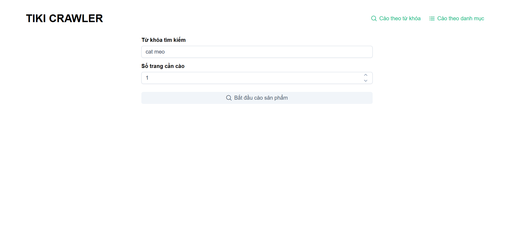
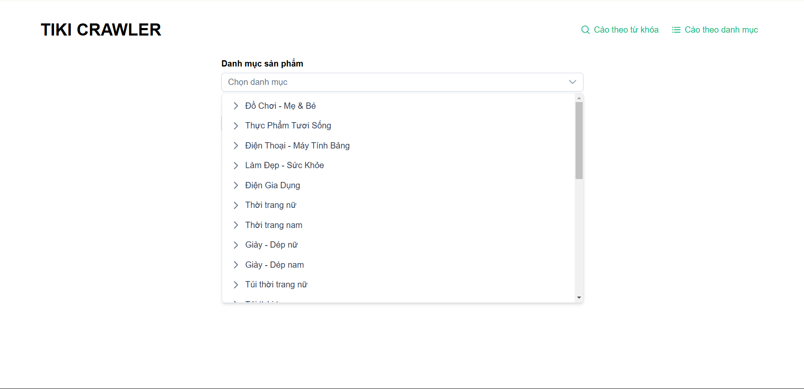
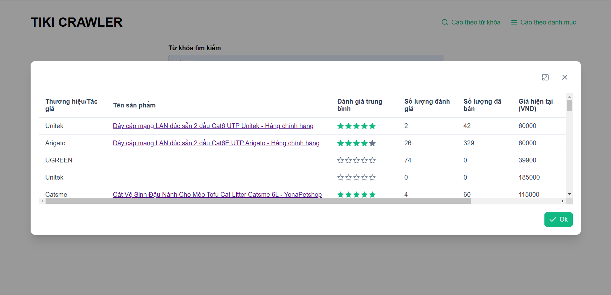
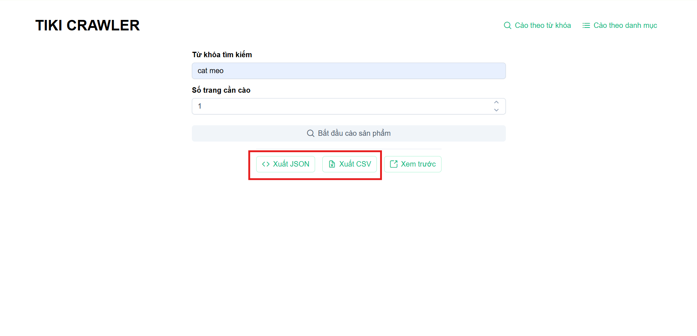
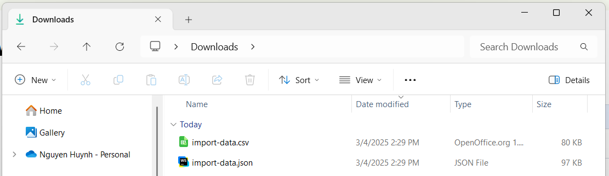
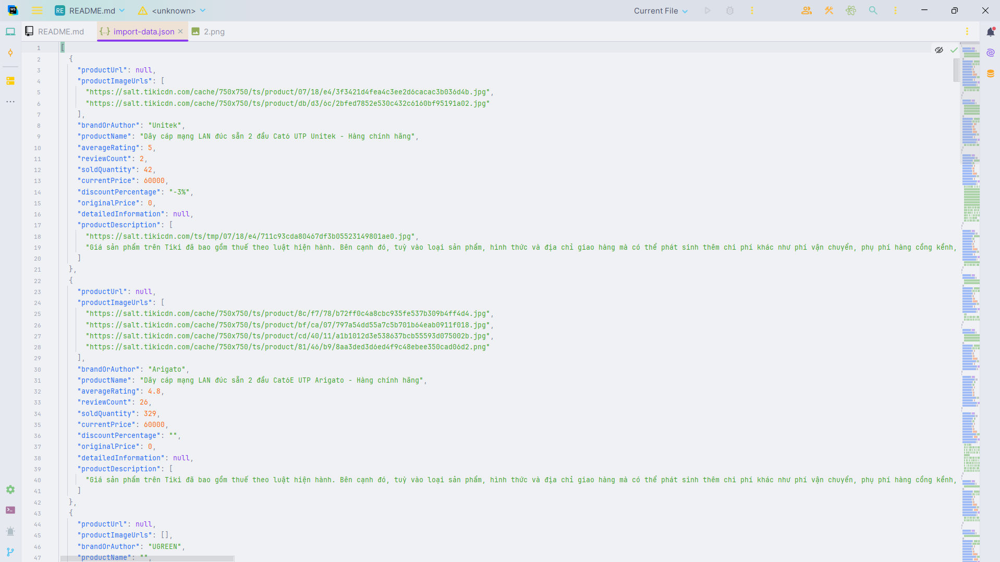
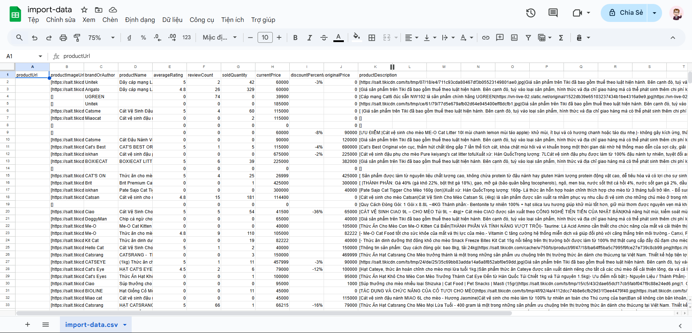

#  Tiki Crawler
## 👋 Giới thiệu

Tiki Crawler là một ứng dụng hỗ trợ cào dữ liệu sản phẩm từ trang thương mại điện tử **Tiki**. Người dùng có thể tìm kiếm sản phẩm theo **từ khóa** hoặc **danh mục ngành hàng**, sau đó xuất dữ liệu ra các định dạng **JSON** hoặc **CSV** để dễ dàng import vào hệ thống **Odoo**.

## 👨‍💻 Tác giả

- **Name:** Nguyễn Huỳnh Thiện Nhân
- **Role:** Java Developer

## ⚙️ Tính năng
- **Cào dữ liệu sản phẩm từ Tiki:**
  - Theo từ khóa (ví dụ: "cát mèo").
  - Theo danh mục ngành hàng (ví dụ: "Điện gia dụng").
- **Xuất dữ liệu:** Dữ liệu xuất ra được định dạng phù hợp
  - File `.json`
  - File `.csv`
- **Sử dụng dữ liệu:** Người dùng có thể sử dụng dữ liệu đã cào để phục vụ mục đích cá nhân hoặc thương mại.

## 📋 Hướng dẫn sử dụng
- **Nhập từ khóa hoặc chọn danh mục sản phẩm cần cào và số trang cần cào ( mỗi trang tương ứng 50 sản phẩm * số trang = tổng sản phẩm )**

- **Xem trước các sản phẩm đã cào được.**

- **Chọn định dạng xuất file: JSON hoặc CSV.**

- **Tải file về và sử dụng data như ý bạn muốn.**

- **Cấu trúc file `.json`**

- **Cấu trúc file `.csv`**

## License
This project is licensed under the ISC License.